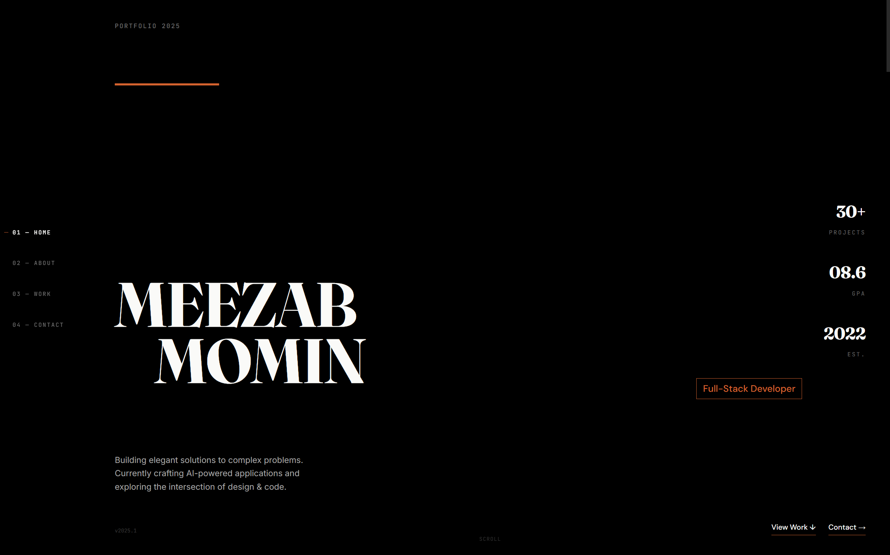

# Meezab Momin - Professional Full-Stack Portfolio

 

A production-grade, highly interactive, and fully responsive personal portfolio website built with **React.js (Vite)** on the frontend and **Node.js, Express, & MongoDB Atlas** on the backend. 

This project demonstrates full-stack capabilities, dynamic data fetching, and graceful degradation principles. It's designed to be a central storage system for all professional projects, making the portfolio scalable, dynamic, and professionally structured.

---

## ✨ Key Features

### Frontend (Client-Side)
- **Modern UI/UX**: Designed with deep dark themes, glassmorphism elements, and precise typography.
- **Dynamic Data Fetching**: Projects are fetched dynamically from the backend REST API via a custom `useProjects` React Hook.
- **Graceful Fallback**: The UI is architected defensively. If the MongoDB backend is offline or unreachable, the frontend automatically falls back to local static JSON data. The site **never breaks**.
- **Smooth Animations**: Utilizes `framer-motion` for scroll reveals, staggered list loading, and page transitions.
- **Skeleton Shimmer Loading**: Sleek loading states simulate data fetching to provide a premium user experience before the API responds.
- **Vite Proxy Configured**: Local development avoids CORS issues using an automated Vite proxy.

### Backend (Server-Side)
- **Express REST API**: A robust Node.js backend providing full CRUD capabilities for the `projects` collection.
- **MongoDB Atlas Database**: Cloud-hosted NoSQL database acting as the single source of truth for all portfolio data.
- **Mongoose Data Modeling**: Strict schema definitions with validation (Enums, maximum lengths, automated slug generation via `pre('save')` hooks).
- **Advanced Querying**: API supports filtering by `category`, `featured` status, and customized sorting logic.
- **Seed Script**: Includes an automated `seed.js` script to quickly populate the database with default projects and wipe old data.

---

## 🛠️ Technology Stack

### Frontend
- **Framework**: React 19 (via Vite 8)
- **Styling**: Vanilla CSS (CSS Variables, Flexbox/Grid layouts)
- **Animations**: Framer Motion
- **Tooling**: TypeScript compiler (for type definitions)

### Backend
- **Runtime**: Node.js
- **Framework**: Express.js (v5)
- **Database**: MongoDB Atlas
- **ODM**: Mongoose (v8)
- **Middleware**: CORS, Dotenv, Express JSON Parser

---

## 🚀 Installation & Setup

### Prerequisites
Make sure you have [Node.js](https://nodejs.org/) installed along with a [MongoDB Atlas](https://www.mongodb.com/cloud/atlas) account.

### 1. Clone the Repository
```bash
git clone https://github.com/QuantumGlitch404/Personal-Portfolio-Website.git
cd Personal-Portfolio-Website
```

### 2. Backend Setup
Navigate to the server directory and install dependencies:
```bash
cd server
npm install
```

Create a `.env` file in the `server/` directory and add your MongoDB connection string:
```env
PORT=5000
MONGODB_URI=mongodb://<your_username>:<your_password>@<your_cluster_url>/?ssl=true&replicaSet=atlas-be58fy-shard-0&authSource=admin&appName=Cluster0
NODE_ENV=development
```

Seed the database (Optional but recommended):
```bash
npm run seed
```

Start the backend server:
```bash
npm run dev
```

### 3. Frontend Setup
Open a new terminal window, navigate back to the project root, and install dependencies:
```bash
cd ..
npm install
```

Start the Vite development server:
```bash
npm run dev
```

Your app should now be running on `http://localhost:5173` with the backend API listening on `http://localhost:5000`.

---

## 📂 Project Structure

```text
📁 Personal-Portfolio-Website
├── 📁 public/                 # Static assets and images
├── 📁 server/                 # Backend Node.js/Express Application
│   ├── 📁 config/             # Database connection logic
│   ├── 📁 models/             # Mongoose schemas (Project.js)
│   ├── 📁 routes/             # Express API routes (projects.js)
│   ├── server.js              # Express app entry point
│   └── seed.js                # Database population script
├── 📁 src/                    # Frontend React Application
│   ├── 📁 components/         # Reusable UI elements and sections
│   │   ├── 📁 layout/         # Page wrappers
│   │   └── 📁 sections/       # Hero, About, Projects, Contact
│   ├── 📁 data/               # Static fallback data files
│   ├── 📁 hooks/              # Custom React hooks (useProjects, etc.)
│   ├── 📁 styles/             # Global CSS and tokens
│   ├── App.jsx                # Main application component
│   └── main.jsx               # React DOM rendering entry
├── index.html                 # HTML entry point
├── package.json               # Root dependencies
└── vite.config.js             # Vite configuration and proxy setup
```

---

## 🔗 API Endpoints Reference

The backend exposes the following RESTful routes:

- `GET /api/projects` - Fetch all projects (Supports `?category=X`, `?featured=true`, `?sort=newest`)
- `GET /api/projects/:idOrSlug` - Fetch a single project by MongoDB `_id` or string `slug`
- `POST /api/projects` - Create a new project
- `PUT /api/projects/:idOrSlug` - Update an existing project
- `DELETE /api/projects/:idOrSlug` - Delete a project

---

## 🛡️ License

This project is licensed under the MIT License - see the LICENSE file for details.

---
*Built with ❤️ by Meezab Momin.*
